<style>
    img {
        text-align: center;
    }
    .split2 {
        display: grid;
        grid-template-columns: repeat(2, minmax(0, 1fr));
        gap: 0.5rem;
    }
    .split3 {
        display: grid;
        grid-template-columns: repeat(3, minmax(0, 1fr));
        gap: 0.5rem;
    }
</style>


# Einen offen***er***en selbst gehosteten Chatbot machen
## Automatisierte Softwareentwicklung, SoSe 2024 ⚙

> Viton Romane, DFIW, 5006508
> Chendjou Dzogouloh Arold Stephyl, DFIW, 5012980
> Setra Thierry Andriamiadanarivo, DFIW, 3880516
> Chrislie Briel Mohomye Yotchouen, PIB, 5013415

---

# Inhalt 📚
<div class="split2"><div>

- Ziel
- Server-Side: _`llama-gpt` for Dummies_ 
- Strukturierung des Verhaltens
- Client-Side: Überblick
- Tests (JUnit, Mockito)
</div><div>

- Statische Codeanalyse
- Site/Reports
- Github Actions
- Zusammenfassung
</div></div>

---
# Ziel 🧭
## Offene Frage ❓ 
- Wie würdet ihr einen Chatbot erstellen?
- Welches Verhalten hätte er?
- An welchen Stellen könnte die Automatisierung stattfinden?

---
# Ziel 🧭
## Was wollen wir eigentlich?
- Nachrichten:
  - schreiben
  - speichern
  - an einer API schicken
- Die Antwort:
  - bekommen & speichern
  - darstellen


> Bild: [pixabay](https://cdn.pixabay.com/photo/2012/04/24/21/35/screen-40956_960_720.png)

---
# Server-Side: *`llama-gpt` for Dummies* 🤖

> Von: https://github.com/getumbrel/llama-gpt


---
# Server-Side: *`llama-gpt` for Dummies* 🤖
## Installierung: 3 Zeilen
```sh
git clone https://github.com/getumbrel/llama-gpt.git
cd llama-gpt
./run.sh --model 7b
```

$\rightarrow$ UI auf `http://localhost:3000`, API auf `http://localhost:3001` 

**Aber: das können sehr schwere Modelle sein! (deswegen: Server-Side)**

---
# Server-Side: *`llama-gpt` for Dummies* 🤖
## Den Server vom Außen erreichbar machen
- Lösung: [`caddy` als Reverse-Proxy](https://github.com/caddyserver/caddy)
- Konfigurationsdateien sind sehr lesbar
  $\rightarrow$ API auf https://gptapi.oc.romaneviton.fr erreichbar

---
# Strukturierung des Verhaltens ✉
<div style="text-align: center">

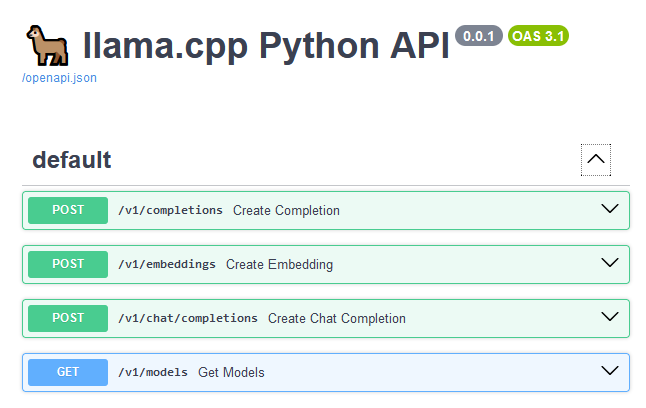
</div>

> Quelle: [die API selbst](https://gptapi.oc.romaneviton.fr)


---

# Strukturierung des Verhaltens ✉
## Eine API, die *sehr* ähnlich zur OpenAI-API ist
<div style="text-align: center">

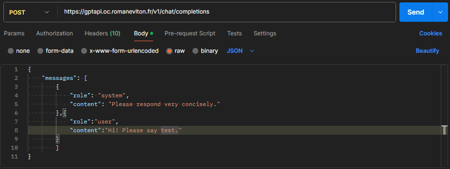
</div>

---

# Strukturierung des Verhaltens ✉
## ...und sie funktioniert!

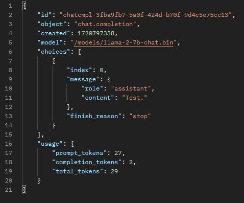

---

# Client-Side: Überblick 🛠
- 3 unterschiedliche Aufgaben
  - Kommunikation mit dem:der Nutzer:in
  - Nachrichtenverlauf speichern
  - Kommunikation mit dem Server

$\implies$ Antwort: **verschiedene Klassen nutzen**

<br>

$\rightarrow$ ***Wie würden diese Klassen miteinander kommunizieren ?***

---
# Client-Side: Überblick 🛠
- 4 Hauptklassen
  - `Chatbot`
  - `CommandLineInterface` (implementiert `UserInterface`)
  - `RequestSender`
  - `Conversation`

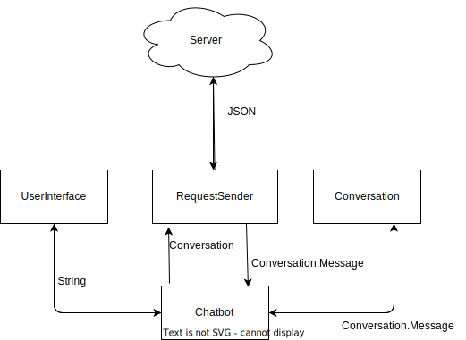

---

# Tests 🧪
## Unit-Tests mit JUnit
- Teile individuell testen, um das Verhalten zu sichern
- Dauerhafte Sicherheit


---


# Tests 🧪
## Mockito: Klassen simulieren
- Erlaubt, einfachere Klassen für Testzwecke zu nutzen

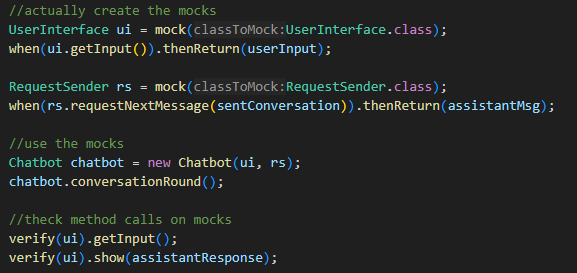

---

# Tests 🧪
## JaCoCo: Testabdeckung 🔎 
- Kann helfen, Stellen zu finden, die nicht getestet sind
- "Welche Tests soll ich jetzt schreiben?"

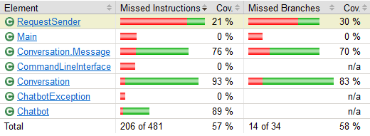

---

# Statische Codeanalyse 📖 ✅ 
- Den Code vor der Laufzeit prüfen
  - `errorprone`, um häufige Fehlermuster zu erkennen (😇)
  - `checkstyle`, um zu sichern, dass der Code an den Stilregeln angepasst ist (🤬)

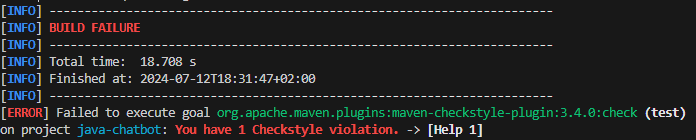

---
# Site/Reports 📢
- `site`-Phase des Maven-Lifecycles
- `pom.xml` enthält Projektdaten
- Möglichkeit, den Stil in `src/site/site.xml` zu definieren
- Reports können hinzugefügt werden (`reportSets` oder Binding an einer Phase)
  - Beispiel: *JaCoCo*

---
# Site/Reports 📢

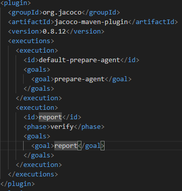

---
# Github Actions: die nächste Ebene 🚀 
- Was kann Github Actions bringen?
  - Sicherheit?
  - Einen geringeren Zeitaufwand?

---

# Github Actions: mehr Sicherheit 🚧
- Wir Menschen sind sehr oft vergesslich
- Eine Ausführung von `mvn clean test` kann schnell fehlen und gepusht werden
- Sicherheitsnetze mit Github Actions erlauben, jeden Push zu prüfen

---

# Github Actions: mehr Sicherheit 🚧

> Aus [.github/workflows/maven.yml](https://github.com/rom-vtn/java-chatbot/blob/main/.github/workflows/maven.yml)

```yaml
jobs:
  build:
    runs-on: ubuntu-latest

    steps:
    - uses: actions/checkout@v4
    - name: Set up JDK 21
      uses: actions/setup-java@v3
      with:
        java-version: '21'
        distribution: 'temurin'
        cache: maven
    - name: Build with Maven
      run: mvn -B clean package site --file pom.xml
```

---
# Github Actions
## Package/Pages erstellen 📦 
> Aus [.github/workflows/maven.yml](https://github.com/rom-vtn/java-chatbot/blob/main/.github/workflows/maven.yml)
```yaml
    - name: Configure GitHub Pages
      uses: actions/configure-pages@v3

    - name: Upload GitHub Pages artifact
      uses: actions/upload-pages-artifact@v1
      with:
        path: target/site
```
---
# Github Actions
## Artefakte herunterladen ⬇
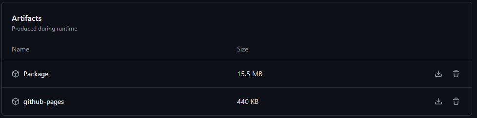

---
# Github Actions: weitere Automatisierungen
## Dependabot

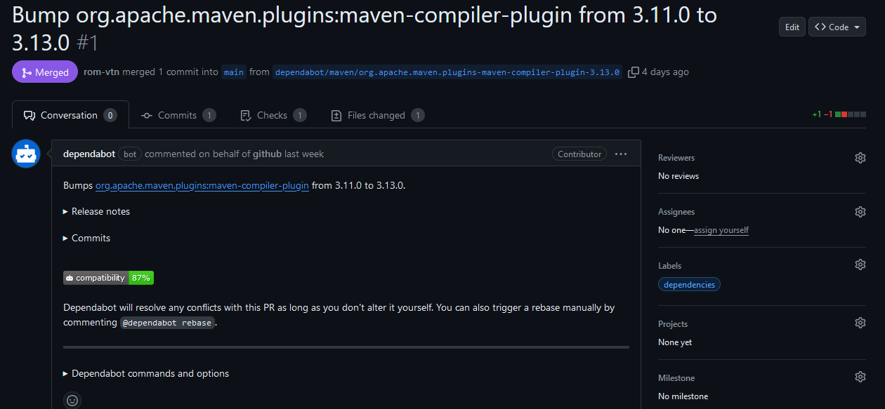

---

# Andere nützliche Tools
## `versions:use-latest-releases`, `dependency:analyze`
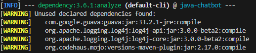

---

# Zusammenfassung ✏
- Automatisierung ist:
  - effizienter
  - sicherer
  - wartbarer

$\implies$ ***Sie erlaubt, sich darum zu kümmern, was wirklich zählt*** 

---

# Danke für Ihre Aufmerksamkeit!
## Noch Fragen?